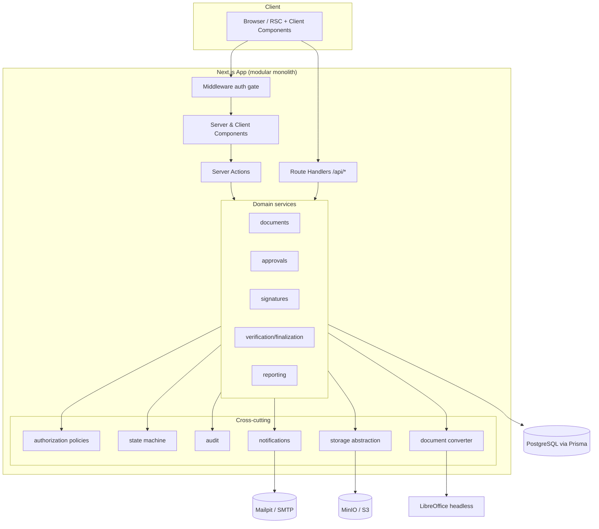
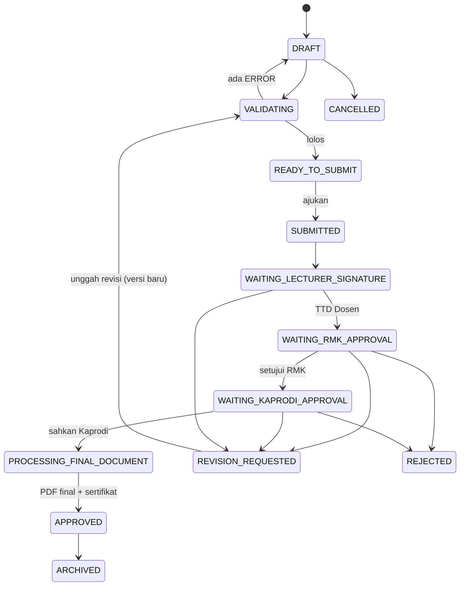

# RPS Sign — Sistem Pengesahan dan Tanda Tangan Digital RPS

Aplikasi web full-stack untuk **pengesahan dan persetujuan digital internal** dokumen
Rencana Pembelajaran Semester (RPS): unggah, validasi, preview, persetujuan berurutan,
tanda tangan elektronik internal, revisi & versioning, pembuatan PDF final ber-QR,
verifikasi integritas SHA-256, audit trail, dan monitoring.

> **Catatan istilah.** Sistem ini menggunakan **“persetujuan digital internal”**, bukan
> tanda tangan elektronik tersertifikasi (TTE) berbasis CA. Cocok untuk pengesahan
> internal institusi.

---

## Daftar Isi
- [Fitur Utama](#fitur-utama)
- [Tech Stack](#tech-stack)
- [Arsitektur](#arsitektur)
- [Alur Persetujuan](#alur-persetujuan)
- [Matriks Peran & Izin](#matriks-peran--izin)
- [Struktur Folder](#struktur-folder)
- [Prasyarat](#prasyarat)
- [Setup Lokal](#setup-lokal)
- [Variabel Lingkungan](#variabel-lingkungan)
- [Menjalankan dengan Docker](#menjalankan-dengan-docker)
- [Akun Demo](#akun-demo)
- [Pengujian](#pengujian)
- [Ringkasan API](#ringkasan-api)
- [Catatan Keamanan](#catatan-keamanan)
- [Keterbatasan yang Diketahui](#keterbatasan-yang-diketahui)
- [Checklist Deployment Produksi](#checklist-deployment-produksi)

---

## Fitur Utama
- **Pengajuan RPS** melalui stepper 5 langkah (identitas → unggah → validasi → penandatangan → review) dengan autosave, progres unggah, deteksi duplikat via hash, dan submit idempoten.
- **Konversi dokumen** DOCX→PDF via LibreOffice headless (PDF diteruskan langsung), dengan verifikasi MIME berbasis _magic bytes_, timeout, dan direktori temporer terisolasi.
- **Rule engine validasi** yang extensible (ERROR memblokir, WARNING dapat dilanjutkan, INFO rekomendasi), memisahkan aturan metadata sistem dari heuristik konten.
- **Workflow persetujuan berurutan** Dosen Pengembang → Koordinator RMK → Kaprodi, dengan state machine tervalidasi, checklist review, SLA, dan invalidasi otomatis saat revisi.
- **Tanda tangan** (gambar / unggah PNG-JPEG / tersimpan) — hanya milik sendiri, revoke, default; SVG ditolak.
- **PDF final** ber-cap tanda tangan, nama & jabatan, waktu, nomor dokumen, dan **QR verifikasi**; SHA-256 dihitung dan disimpan.
- **Verifikasi publik** via token opaque (`/verify/{token}`) dengan pengungkapan metadata minimum + rate limiting; cek hash unggahan.
- **Audit trail** append-only, **notifikasi** in-app + email (Mailpit), **monitoring** metrik + ekspor CSV.

## Tech Stack
Next.js 15 (App Router) · React 19 · TypeScript (strict) · Tailwind CSS v4 · Radix UI ·
Lucide · PostgreSQL · Prisma 6 · Auth.js (NextAuth v5) + Argon2id · React Hook Form · Zod ·
TanStack Table · Recharts · pdf-lib · qrcode · signature_pad · Vitest + Testing Library ·
Playwright · Docker Compose (PostgreSQL, MinIO, Mailpit) · pnpm.

## Arsitektur
Modular monolith. UI (Server Components secara default) memanggil **domain services**
yang berbicara ke **repository (Prisma)**. Lintas-domain diabstraksikan: storage,
document processing, audit, notification, authorization policy.



## Alur Persetujuan



Setiap transisi divalidasi di service, menulis audit event, dan membuat notifikasi.
Saat revisi diminta, seluruh persetujuan versi berjalan **diinvalidasi**; unggahan revisi
membuat **DocumentVersion** baru dan siklus persetujuan diulang dari awal.

## Matriks Peran & Izin

| Kapabilitas | DOSEN | KOORDINATOR_RMK | KAPRODI | ADMIN | AUDITOR |
|---|:--:|:--:|:--:|:--:|:--:|
| Buat / edit / ajukan RPS (miliknya) | ✅ | — | — | — | — |
| Baca dokumen | miliknya | rumpun-nya | prodi-nya | semua | final saja |
| Mulai review / checklist / aksi tahap aktif | TTD tahap-1 | ✅ (rumpun) | ✅ (prodi) | — | — |
| Terapkan tanda tangan | ✅ | ✅ | ✅ | — | — |
| Unggah revisi | ✅ | — | — | — | — |
| Arsipkan dokumen | — | — | — | ✅ | — |
| Kelola master data / pengguna / workflow / template / pengaturan | — | — | — | ✅ | — |
| Baca audit log | (dokumennya) | — | — | ✅ | ✅ |
| Monitoring / laporan | ringkas | ✅ | ✅ | ✅ | ✅ |

Semua pemeriksaan izin dilakukan **di server** (`src/domain/permissions.ts` +
`src/server/auth/session.ts`). Menyembunyikan tombol di UI **bukan** pengganti otorisasi backend.

## Struktur Folder
```
src/
  app/
    (auth)/         login, forgot/reset password
    (app)/          dashboard, documents, approvals, monitoring, archive,
                    notifications, profile, signatures, admin/*
    verify/         halaman verifikasi publik
    api/            route handlers (documents, approvals, verify, reports, ...)
  components/       ui/ (primitives) + komponen fitur
  domain/           logika murni: permissions, state-machine, sla, document-number, status
  lib/              env, prisma, logger, crypto, password, rate-limit, api, format, utils
  server/
    auth/           konfigurasi Auth.js, session, policies
    documents/      service + repository + validation
    approvals/      service + queries
    signatures/     service
    verification/   finalization (stamping/QR) + verification service
    notifications/  mailer + notification service
    audit/          audit service + actions
    reporting/      metrics + CSV
    storage/        abstraksi local + S3 (signed URL)
    processing/     konverter dokumen (LibreOffice)
prisma/             schema.prisma + seed.ts
tests/              unit/ · integration/ · e2e/
```

## Prasyarat
- Node.js ≥ 20.11, **pnpm** 9 (`corepack enable`)
- PostgreSQL 16 (atau gunakan Docker Compose)
- LibreOffice (`soffice`) untuk konversi DOCX — opsional bila hanya mengunggah PDF
- Docker + Docker Compose (opsional, untuk stack lengkap)

## Setup Lokal
```bash
pnpm install
cp .env.example .env            # sesuaikan; isi AUTH_SECRET (openssl rand -base64 32)
pnpm exec prisma generate
pnpm exec prisma db push        # atau: pnpm db:migrate (membuat migrasi)
pnpm db:seed                    # data contoh + akun demo
pnpm dev                        # http://localhost:3000
```

Perintah lain: `pnpm lint`, `pnpm typecheck`, `pnpm test`, `pnpm build`, `pnpm start`.
Tersedia juga `Makefile` (`make help`).

## Variabel Lingkungan
Lihat [`.env.example`](.env.example). Kunci penting:

| Variabel | Deskripsi |
|---|---|
| `DATABASE_URL` | Koneksi PostgreSQL |
| `AUTH_SECRET` | Rahasia sesi Auth.js (≥ 32 byte acak) |
| `APP_URL` / `NEXT_PUBLIC_APP_URL` | Basis URL (dipakai tautan verifikasi) |
| `STORAGE_DRIVER` | `local` (tanpa Docker) atau `s3` (MinIO) |
| `S3_*` | Kredensial & endpoint MinIO/S3 |
| `MAIL_DRIVER` | `smtp` (Mailpit) atau `console` |
| `LIBREOFFICE_BIN` | Path biner `soffice` |
| `DOC_MAX_UPLOAD_BYTES` | Batas ukuran unggah dokumen |

## Menjalankan dengan Docker
```bash
export AUTH_SECRET=$(openssl rand -base64 32)
docker compose up -d --build
```
Menyediakan **PostgreSQL**, **MinIO** (`:9001` konsol), **Mailpit** (`:8025` UI),
menjalankan migrasi + seed, lalu aplikasi di **http://localhost:3000**.

## Akun Demo
Kata sandi semua akun: **`Password123!`** (hanya untuk demo lokal — jangan dipakai di produksi).

| Peran | Email |
|---|---|
| Dosen Pengembang | `dosen@yppi-rembang.ac.id` |
| Koordinator RMK | `koordinator@yppi-rembang.ac.id` |
| Ketua Program Studi | `kaprodi@yppi-rembang.ac.id` |
| Admin | `admin@yppi-rembang.ac.id` |
| Auditor | `auditor@yppi-rembang.ac.id` |

Perintah `pnpm db:seed` mencetak **tautan verifikasi publik** dokumen yang telah disahkan.

## Pengujian
```bash
pnpm test                 # unit (Vitest + Testing Library) — state machine, policies, validasi, hash, SLA, dll.
RUN_INTEGRATION=1 DATABASE_URL=... pnpm test:integration   # integrasi (butuh PostgreSQL)
pnpm test:e2e             # Playwright (butuh instance ter-seed berjalan)
```
Integration test mencakup: submit → persetujuan berurutan → finalisasi + sertifikat,
penolakan akses lintas-peran, dan invalidasi persetujuan saat revisi.

## Ringkasan API
Semua endpoint memakai envelope standar `{ ok, data }` / `{ ok, error: { code, message } }`.

| Method | Endpoint | Keterangan |
|---|---|---|
| POST/GET | `/api/documents` | buat draf / daftar (ter-scope) |
| GET/PATCH | `/api/documents/:id` | detail / simpan metadata |
| POST | `/api/documents/:id/upload` | unggah + konversi versi |
| POST | `/api/documents/:id/validate` | jalankan validasi |
| POST | `/api/documents/:id/submit` | ajukan (idempoten) |
| POST | `/api/documents/:id/revisions` | unggah versi revisi |
| GET | `/api/documents/:id/audit` | audit trail dokumen |
| POST | `/api/documents/:id/approvals/:approvalId/start` | mulai review |
| PATCH | `.../approvals/:approvalId/checklist` | simpan checklist |
| POST | `.../approvals/:approvalId/approve\|revision\|reject` | aksi persetujuan |
| GET | `/api/approvals/me` | antrean persetujuan saya |
| GET/PATCH | `/api/notifications` · `/:id/read` | notifikasi |
| GET | `/api/verify/:token` | verifikasi publik (rate-limited) |
| GET | `/api/reports/summary` · `/export` | metrik · ekspor CSV |
| GET | `/api/health` · `/api/ready` | liveness · readiness |
| GET | `/api/files/download` | unduhan bertanda-tangan HMAC (terikat sesi) |

## Catatan Keamanan
- Argon2id untuk hashing kata sandi; sesi cookie via Auth.js (JWT) + CSRF bawaan.
- Otorisasi selalu di server; scoping berdasarkan peran + penugasan aktif; proteksi IDOR.
- Rate limiting login (5/5 menit) dan endpoint verifikasi.
- Verifikasi MIME berbasis isi berkas; batas ukuran; sanitasi nama berkas.
- Berkas hanya diakses via URL bertanda-tangan **HMAC** yang kedaluwarsa & terikat pengguna (bukan URL publik permanen); `Content-Disposition` + `nosniff`.
- Security headers + CSP (`next.config.ts`), `frame-ancestors 'none'`, HSTS.
- Token verifikasi publik **opaque**; hanya hash-nya disimpan. Audit tidak menyimpan kata sandi/token/biner tanda tangan.
- Rahasia hanya dari environment variable; tidak ada rahasia di repositori.

## Keterbatasan yang Diketahui
- **Konversi DOCX** berjalan _in-process_ via LibreOffice (`DocumentConverter` adalah _seam_ untuk memindahkannya ke worker terpisah). Bila `soffice` tidak tersedia, unggah PDF tetap berfungsi penuh.
- Validasi konten DOCX bersifat **heuristik** (bukan parsing struktur akademik penuh) — sesuai desain, terpisah dari validasi metadata sistem.
- Rate limiter in-memory (ganti dengan Redis untuk multi-instance).
- Persetujuan digital **internal**, bukan TTE tersertifikasi CA.
- Ekspor PDF/Excel laporan diabstraksikan untuk iterasi berikutnya (CSV tersedia).

## Checklist Deployment Produksi
- [ ] Set `AUTH_SECRET` acak kuat; `NODE_ENV=production`; `APP_URL` sesuai domain (HTTPS).
- [ ] Gunakan PostgreSQL terkelola + `prisma migrate deploy` (bukan `db push`).
- [ ] Object storage S3 nyata; kredensial via secret manager.
- [ ] SMTP produksi; matikan akun demo & ganti kata sandi.
- [ ] Aktifkan HTTPS/HSTS di edge; review CSP.
- [ ] Rate limiter berbasis Redis; logging/observability (adapter Sentry/OTel tersedia).
- [ ] Backup DB & storage; uji restore. Pindahkan konversi ke worker bila beban tinggi.
```
